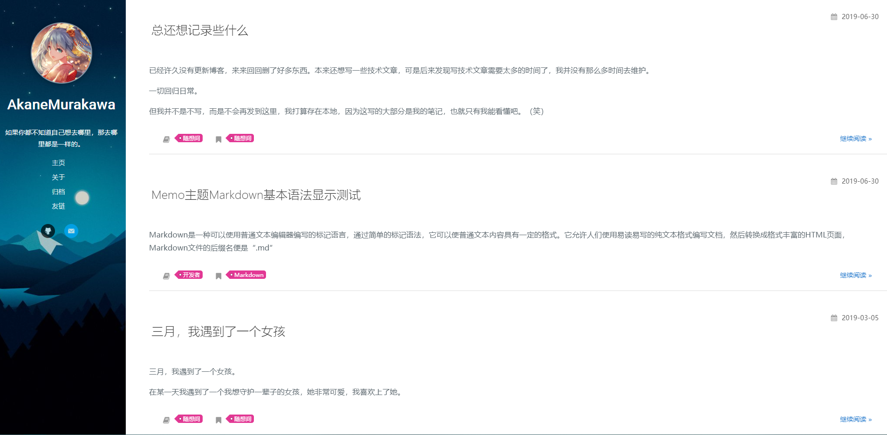

# hexo-theme-memo



本主题基于[black-blue](https://github.com/maochunguang/black-blue)和[theme_greyshade](https://github.com/otale/theme_greyshade),[hexo-theme-spfk](https://github.com/luuman/hexo-theme-spfk)修改而成，具体使用请参考官方文档。

# 说明
本主题只是做了简单的样式修改，修改的风格完全属于个人癖好。由于个人精力有限手机版并未完全适配，下面是修改说明：
1. 将主题由黑色调整为白色
2. 将主题的代码高亮风格修改为IDEA的Darcula风格
3. 新增建站开始时间
4. 调整Markdown显示样式
5. 创作共享协议调整为「署名 4.0 国际」 
6. 调整gitment对齐显示
7. 其他的小地方也对显示的样式做了修改

### 显示建站时间
修改theme下的`_config.yml`，修改内容：
```
# 建站时间
start: 2017-
```

### 添加文章摘要
如果在添加文章的时候不添加摘要，默认在首页会全文显示。在这里[hexo-theme-spfk](https://github.com/luuman/hexo-theme-spfk)的作者设置摘要是手动控制内容。添加例子如下：
```
<Excerpt in index | 首页摘要>

Markdown是一种可以使用普通文本编辑器编写的标记语言，通过简单的标记语法，它可以使普通文本内容具有一定的格式。它允许人们使用易读易写的纯文本格式编写文档，然后转换成格式丰富的HTML页面，Markdown文件的后缀名便是“.md”

<!-- more -->
<The rest of contents | 余下全文>

# 欢迎使用 Markdown在线编辑器 MdEditor

**Markdown是一种轻量级的「标记语言」**
```

**说明**
```

<Excerpt in index | 首页摘要>
这里便是摘要部分，这也会直接在全文中显示，所以余下全文就不必重复摘要的内容了。
<!-- more -->
<The rest of contents | 余下全文>
```

